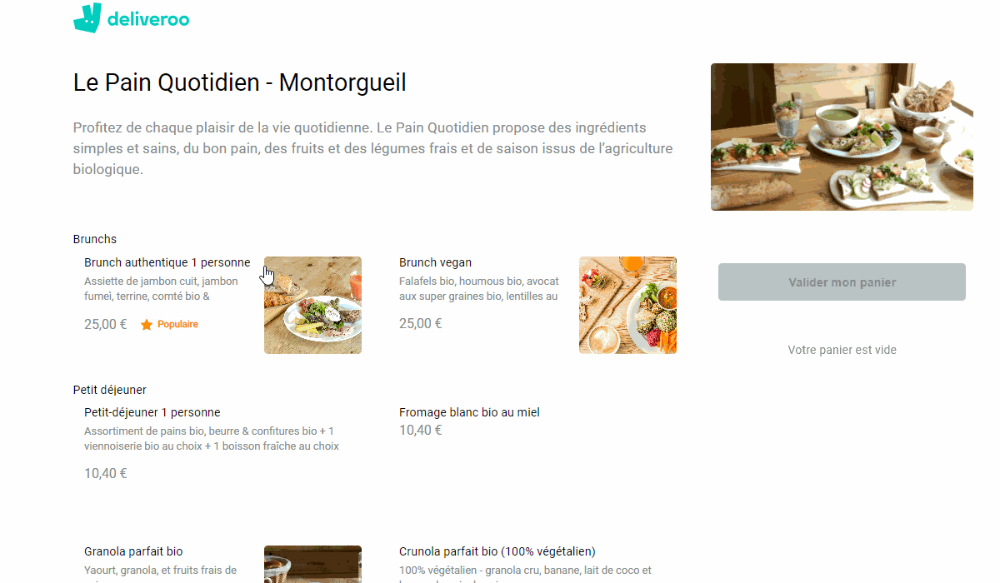

# Deliveroo API

API created to run this [app](https://github.com/zMzMTV/Deliveroo-Front)

# Features

- All items sold by the restaurant are saved in a route `.get`.
  This route is used to display all element of the front-end project.

# Packages Used

- [express](https://www.npmjs.com/package/express)

- [cors](https://www.npmjs.com/package/cors)

# Install

Just run `npm` in your console to install all dependencies and `npx nodemon index.js` to launch.

